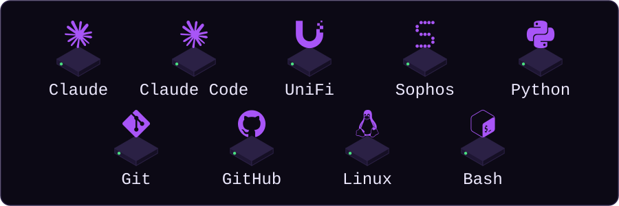

<!-- GENERIERT aus src/readme.md durch scripts/build.py – bitte dort bearbeiten. -->

## `$ whoami`

  <picture>
    <source media="(prefers-color-scheme: dark)" srcset="assets/hero-dark.svg">
    <source media="(prefers-color-scheme: light)" srcset="assets/hero-light.svg">
    
  </picture>

## `$ ls ~/tools`

  <picture>
    <source media="(prefers-color-scheme: dark)" srcset="assets/tools-dark.svg">
    <source media="(prefers-color-scheme: light)" srcset="assets/tools-light.svg">
    
  </picture>

## `$ ls ~/projects`

  <a href="https://github.com/BBZ-AIFS51/LF7-Projekt_GAS"><picture><source media="(prefers-color-scheme: dark)" srcset="assets/project-1-dark.svg"><source media="(prefers-color-scheme: light)" srcset="assets/project-1-light.svg"></picture></a>
  <picture>
    <source media="(prefers-color-scheme: dark)" srcset="assets/project-2-dark.svg">
    <source media="(prefers-color-scheme: light)" srcset="assets/project-2-light.svg">
    
  </picture>

## `$ git log --since=52.weeks`

  <picture>
    <source media="(prefers-color-scheme: dark)" srcset="assets/skyline-dark.svg">
    <source media="(prefers-color-scheme: light)" srcset="assets/skyline-light.svg">
    
  </picture>

  <picture>
    <source media="(prefers-color-scheme: dark)" srcset="assets/footer-dark.svg">
    <source media="(prefers-color-scheme: light)" srcset="assets/footer-light.svg">
    
  </picture>

