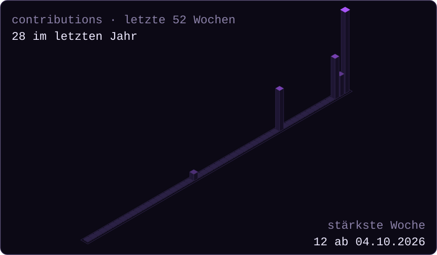

<!-- GENERIERT aus src/readme.md durch scripts/build.py – bitte dort bearbeiten. -->

  <picture>
    <source media="(prefers-color-scheme: dark)" srcset="assets/hero-dark.svg">
    <source media="(prefers-color-scheme: light)" srcset="assets/hero-light.svg">
    
  </picture>

  <picture>
    <source media="(prefers-color-scheme: dark)" srcset="assets/stack-dark.svg">
    <source media="(prefers-color-scheme: light)" srcset="assets/stack-light.svg">
    
  </picture>

### `$ whoami`

Jan, Azubi Fachinformatiker für Systemintegration. 
Netzwerk, IT-Sicherheit, Server & Linux – beruflich und im eigenen Homelab.

### `$ ls ~/projects`

- **[LF7-Projekt_GAS](https://github.com/BBZ-AIFS51/LF7-Projekt_GAS)** – Schul-Teamprojekt: kleine Alarmanlage auf Mikrocontroller-Basis mit PIN-Feld, RFID und Bewegungsmelder, 3D-gedrucktem Gehäuse und interaktivem 3D-Modell im Browser
- **Berichtspilot** – portable Electron-App für Ausbildungsnachweise

### `$ git log --since=52.weeks`

  <picture>
    <source media="(prefers-color-scheme: dark)" srcset="assets/skyline-dark.svg">
    <source media="(prefers-color-scheme: light)" srcset="assets/skyline-light.svg">
    
  </picture>

  <picture>
    <source media="(prefers-color-scheme: dark)" srcset="assets/footer-dark.svg">
    <source media="(prefers-color-scheme: light)" srcset="assets/footer-light.svg">
    
  </picture>

